# CashInflow

**给中国留学生的本地记账本** · 多币种实时汇率 · 首页可切自然月 / 生活费周期 / 任意区间

<p>
  
  
  
  
  
  
  
  
</p>

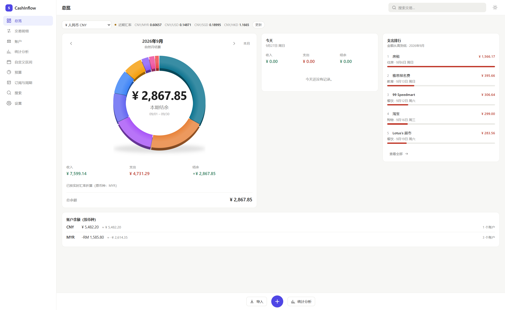

---

## 这是什么

一个运行在 Windows 上的个人记账软件。所有数据保存在你自己电脑的 SQLite 数据库里，
不需要注册账号，不联网也能完整使用。

它和普通记账 App 的区别在四个地方。

---

### 1️⃣ 首页可以切换统计周期：自然月 / 结算周期 / 自定义区间

**这是整个软件最核心的设计。**

大多数记账软件的首页只会告诉你「本月」——而「本月」到底是哪一个月，是软件替你决定的。

CashInflow 把它交给你：

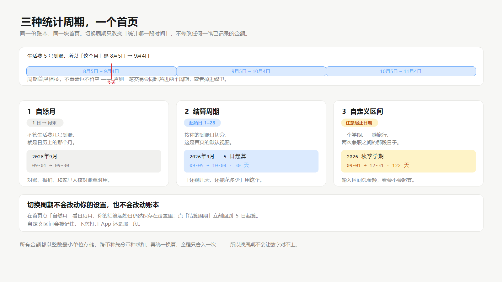

| 模式 | 统计哪一段 | 什么时候用 |
|---|---|---|
| **自然月** | 1 日 → 月末 | 对账、报销、和家里核对账单 |
| **结算周期** | 你设定的起始日 → 下个月的前一天 | 生活费 5 号到账？那就是 8月5日 – 9月4日 |
| **自定义区间** | 你选的任意起止日期 | 一个学期、一趟旅行、两次兼职之间 |

**三种模式共用同一块首页**——同一个圆环、同一组收入/支出/结余、同一个支出排行。
切换周期只是换一个问题，不是换一个页面。

圆环中间的**本期结余**是这一段区间的收入减支出；下面单独一行是账户**余额**，
也就是你现在实际有多少钱。两者不是一回事：一笔期初余额不是收入，所以一段没有
任何交易的区间，本期结余确实是 0，但余额照样在那里。这种情况圆环中间会写
「本周期无收支」而不是显示一个看起来像加载失败的 ¥0.00。

首页点一下就能切：

| 自然月 | 结算周期 | 自定义区间 |
|---|---|---|
| 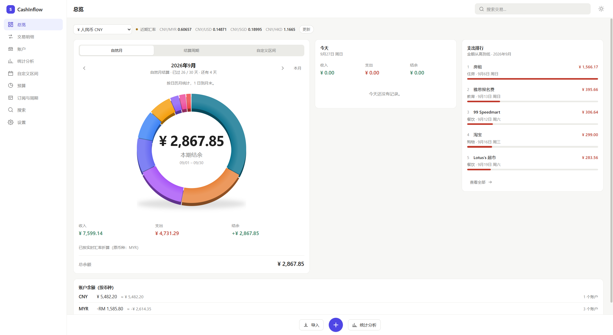 |  | 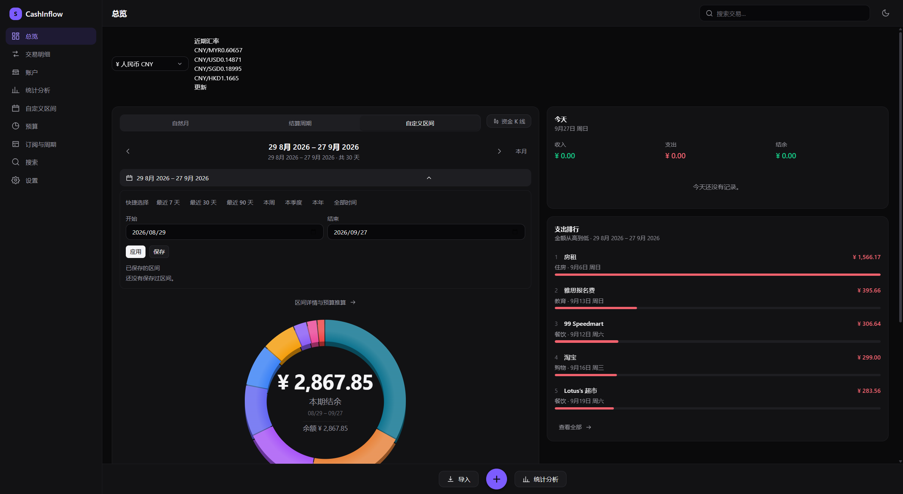 |

> **为什么不是简单地把自然月改成「起始日 = 1」？**
>
> 因为那样的话，想看一眼日历月就得先改设置、再改回来。
> 现在的做法是：**「自然月」只是这一次请求的起始日**，你保存的结算起始日不会被改写。
> 切换模式会记住，下次打开还是你上次看的那一段。

#### 生活费周期：为什么最多只能设到 28 日

如果你每月 5 号收到家里打的生活费，那么「本月」对你来说其实是 **8月5日 – 9月4日**。

用自然月统计会怎样？9 月 3 日打开 App，它告诉你「本月支出 ¥0」——你确实还没开始花这个月的钱。
但真实情况是你正处在上一周期的末尾，钱快花完了。

```
设置起始日 = 5

  ├──────────────┤├──────────────┤├──────────────┤
  8月5日       9月4日          10月4日
   └── 周期 A ──┘└── 周期 B ──┘
```

> **为什么最多只能设到 28 日？** 设成 31 日的话，2 月没有 31 号，周期长度会在
> 28–31 天之间变化，同一笔交易可能落进不同周期。上限 28 保证每个周期长度
> 都是一个月。设置界面里也写明了这一点。

#### 自定义区间：输入总金额，看会不会超支

任意起止日期，外加一个「这段日子一共带了多少钱」：

```
区间支出 / 总金额           ¥ 4,731.29 / ¥ 5,000.00
━━━━━━━━━━━━━━━━━━━━━━━━━━━━━━━━━━━━━━━━━━━━━━━━━━━━

剩余 ¥268.71     日均支出 ¥175.23     已过 27 / 30 天
                                       按此速度预计 ¥5,256.90
                                       按当前速度会超出总金额
```

重点是最后那行——**按当前速度会不会超支**，这才是「还能撑多久」的答案。
首页显示这个区间的收支，点「区间详情与预算推算」进入完整页面：

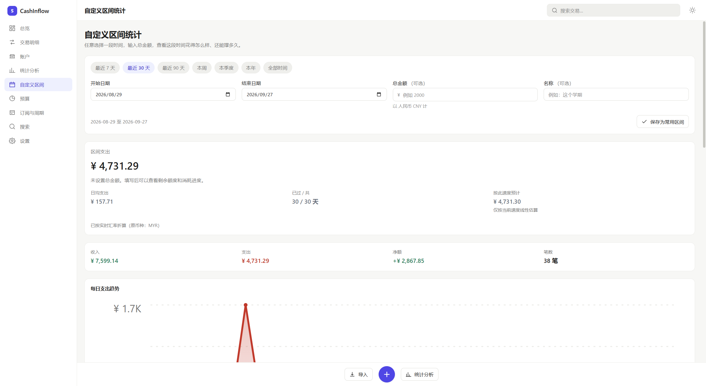

---

### 2️⃣ 真正的多币种，切换一下所有数字立刻变

人民币、马币、新币、美元、港币……同时持有多个币种账户。顶部切换显示货币，
**首页、交易明细、统计、总账**会一起换算。

```
¥ 人民币 CNY ▾    ● 今日汇率  CNY/MYR 0.60657  CNY/USD 0.14871  CNY/SGD 0.18995
```

| 按人民币显示 | 按马币显示 |
|---|---|
|  | 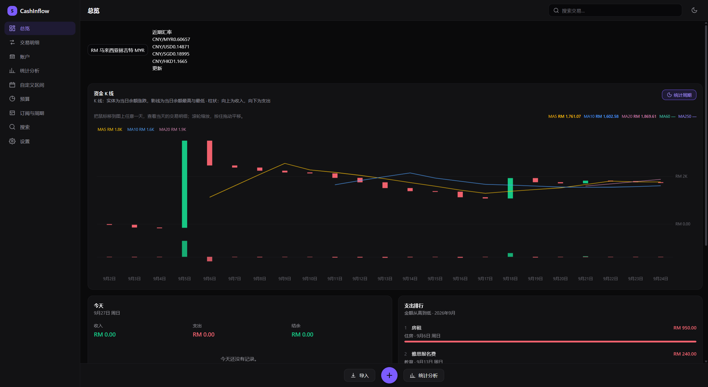 |

**切换货币只改变显示方式，不会修改任何一笔已记录的金额。** 账本永远以钱实际
发生的币种记账，所以对账时你看到的永远是银行账单上的那个数字。

---

### 3️⃣ 导入微信 / 支付宝 / 银行账单

不用手工录入。导出账单文件，选进来：

```
选择文件 → 解析 → 预览 → 检测重复 → 你确认 → 写入
```

支持 **微信支付**、**支付宝**（GBK 编码 + 24 行前言）、**Maybank**、**CIMB**，
以及任意通用 CSV / XLSX。

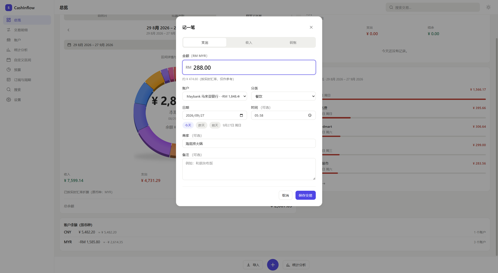

### 4️⃣ 算错的代价是「你照着错的数字做了决定」

金融软件出错的代价不是「不好看」。所以下面这些不是泛泛的「最佳实践」，而是
具体防住了某类真实 bug 的做法——完整清单见 [优势：数据正确性](#优势数据正确性)：

```
金额      一律用整数存最小单位（分/仙），不用小数
跨币种    先按币种分组求和，再统一换算，全程只舍入一次
汇率缺失  按原币显示并标注，绝不当成 1:1
转账      写两行并共享一个 transfer_id，从结构上被排除出收支
余额      由账本推导，绝不落库
```

---

## 功能截图

### 统计分析：趋势、构成、日历

日 / 周 / 月 / 年四种粒度，折线趋势 + 分类构成，下面是日历视图，点任意一天看当天明细。

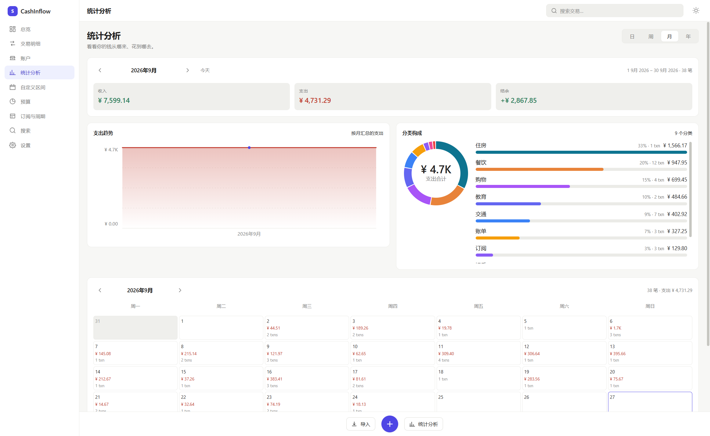

### 账户：多币种余额分开看

不同货币的余额**不会相加**（¥5,000 和 RM5,000 不是一回事）。每个币种单独一行，
同时给出折算值：

```
账户余额（按币种）
CNY      ¥ 5,482.20     ≈ ¥ 5,482.20        1 个账户
MYR     -RM 1,585.80    ≈ -¥ 2,614.35       3 个账户
```

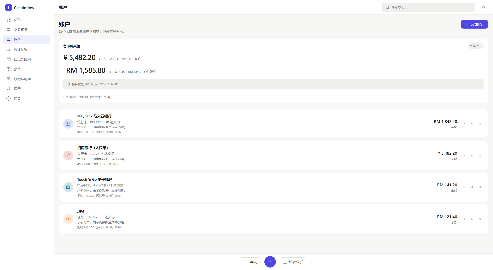

### 汇率与设置

三个免费汇率源自动回退，本地缓存，离线可用，支持手动填写你银行的真实汇率。

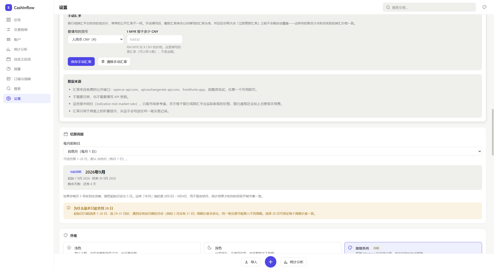

### 深色模式

浅色是默认主题。深色模式保持同样的信息层级，不是简单地把背景刷黑。

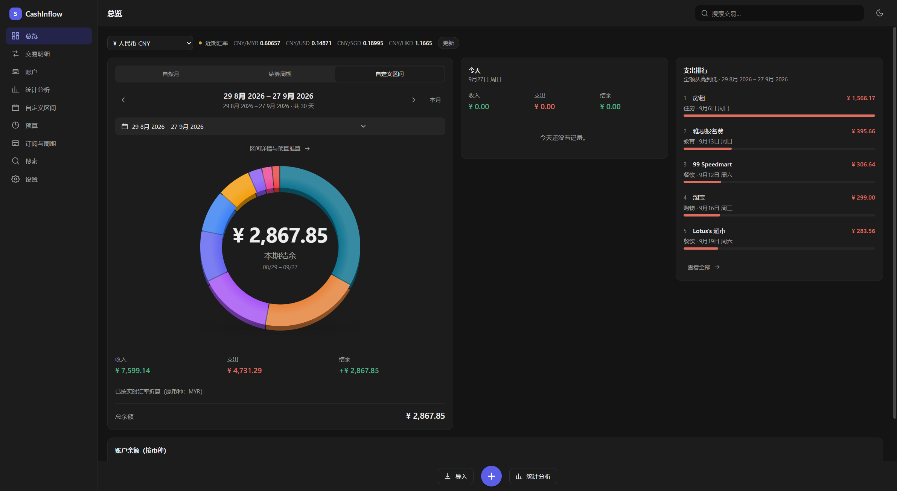

---

## 优势：数据正确性

金融软件出错的代价不是「不好看」，而是**你根据错误的数字做了决定**。
下面每条都不是泛泛的「最佳实践」，而是具体防住了某类真实的 bug。

### 金额一律用整数存，不用小数

```js
// 浮点数会这样：
0.1 + 0.2          // 0.30000000000000004
100.1 + 200.2      // 300.29999999999995

// CashInflow 存整数：
10010 + 20020      // 30030  精确等于 ¥300.30
```

数据库里 `¥18.50` 存成 `1850`（分），`RM 18.50` 存成 `1850`（仙）。
只在最后显示时才格式化成小数。

### 跨币种聚合绝不直接相加

最容易写错的代码长这样：

```sql
SELECT SUM(amount) FROM transactions WHERE date BETWEEN ? AND ?   -- ❌
```

只要你有两个币种的账户，这行代码就会把 `2800`（分）和 `1850`（仙）加起来得到 `4650`——
**一个看起来很合理、实际毫无意义的数字**。

正确做法是按币种分组、各自换算、最后合并，**全程只舍入一次**：

```sql
GROUP BY currency   -- 先分币种，组内求和是精确的
```

### 没有汇率时，绝不假装汇率是 1

某个币种查不到汇率时，金额会**按原币显示并标注 `*`**，同时明确告诉你汇率缺失。
凭空按 1:1 换算是最危险的失败方式——因为结果看起来完全正常。

### 转账永远不会被算成支出

转账写**两行**（`type = 'transfer'`），一出一进，用一张 `transfers` 表关联。
所有收入/支出统计都按 `type` 过滤，转账**从结构上**就被排除了——
不存在「某个查询忘了特殊处理」的可能。

```
Maybank → Cash RM500

Maybank   -500.00    转账腿
Cash      +500.00    转账腿
本期支出   不变
总余额     不变
```

### 余额永远由账本推导，不落库

```
余额 = 期初余额 + SUM(所有交易的有符号金额)
```

存一个「当前余额」字段等于维护第二份真相，某条写入路径忘了更新就会漂移。
个人账本规模下 `SUM` 是瞬间的，所以正确性优先。

### 其他不妥协的地方

- **有交易的账户不能删除** → 提示改为归档，历史记录不会被顺手清掉
- **在用的分类不能删除** → 让你选择把交易转移到哪个分类，绝不静默改成「其他」
- **周期无缝铺满日历**（有测试直接断言）：有缝隙会漏掉交易，有重叠会重复计算
- **重复导入不会翻倍**：微信/支付宝用交易单号做键；没有单号时用内容哈希 +
  出现序号，**同一天真的喝了两杯咖啡两笔都能导入，重新导入同一个文件则全部识别为重复**
- **账户币种一旦有交易就不能改**：存储的整数会被重新解释成另一种货币

---

## 隐私与安全

| | |
|---|---|
| 数据位置 | `%APPDATA%\CashInflow\spendwise.db` |
| 联网 | **仅**汇率查询。三个免费公开接口，无需 API Key |
| 遥测 / 分析 | 无 |
| 远程数据库 | 无 |
| 渲染进程网络权限 | **被 CSP 完全禁止**，汇率请求统一走主进程，可审计 |
| 数据库加密 | 无（请配合 BitLocker 等全盘加密） |

架构上渲染进程**碰不到数据库、碰不到文件系统**：

```
┌──────────────────────────────────────────────┐
│  渲染进程 (React，无 Node 权限)               │
└───────────────────┬──────────────────────────┘
                    │  window.api.<方法>()  仅白名单
┌───────────────────▼──────────────────────────┐
│  preload（唯一桥梁，不暴露 ipcRenderer 本身） │
└───────────────────┬──────────────────────────┘
                    │  只传数据，不传 SQL
┌───────────────────▼──────────────────────────┐
│  主进程：校验 → 业务规则 → 参数绑定查询       │
└───────────────────┬──────────────────────────┘
                    │
┌───────────────────▼──────────────────────────┐
│  SQLite（本地文件，WAL 模式）                 │
└──────────────────────────────────────────────┘
```

没有任何通道接受 SQL 字符串。商户名写成 `'; DROP TABLE transactions; --`
也只是一个名字奇怪的商户。

---

## 安装使用

前往 **[Releases](https://github.com/Lidazou/CashInflow/releases/latest)** 下载。

| 文件 | 说明 |
|---|---|
| `CashInflow-1.3.0-x64-setup.exe` | **安装版**。创建开始菜单与桌面快捷方式，并注册卸载项 |
| `CashInflow-1.3.0-x64-portable.exe` | **免安装单文件版**。直接双击运行，不写注册表、不建快捷方式 |
| `SHA256SUMS.txt` | 上面两个文件的 SHA-256 校验和 |

两个版本功能完全相同，读写同一个数据库。

**不需要管理员权限**，也**不需要预装 Node.js 或任何运行环境** —— 116 MB 里已经包含
整个 Electron 运行时。这就是它比普通记账软件大的原因。

> 安装包没有代码签名证书，所以 Windows SmartScreen 可能会提示「未知发布者」。
> 点「更多信息」→「仍要运行」即可。介意的话可以用免安装版，或者先核对
> `SHA256SUMS.txt` 里的校验和。

### 卸载

从「设置 → 应用」或开始菜单卸载。**卸载不会删除你的账本数据** —— 数据库留在
`%APPDATA%\CashInflow`，重新安装后账目原样还在。

### 第一次打开

```
启动 → 欢迎页 → 建立第一个账户（名称、类型、币种、期初余额） → 总览
```

想先看看效果，点欢迎页的 **「用示例数据体验」**。示例数据只能加到空账本里，
可以一键清除，不会影响你之后记录的真实数据。

---

## 开发

需要 Node.js 22.12 或更高版本。

```bash
npm install          # 安装依赖

npm run dev          # 开发模式（热重载）
npm test             # 运行测试
npm run typecheck    # 类型检查
npm run build        # 生产构建
npm run dist         # 打包 Windows 安装程序
```

> **关于 npm 缓存**：本项目的 `.npmrc` 把缓存指向工作区内目录。某些沙箱环境会
> 导出 `npm_config_cache` 环境变量，而 npm 的环境变量优先级高于项目 `.npmrc`，
> 此时需要显式传参：`npm install --cache "C:\path\to\.npm-cache"`

### 项目结构

```
src/
├── main/                    Electron 主进程
│   ├── database/
│   │   ├── connection.ts    打开、配置（WAL、外键）、迁移、备份
│   │   ├── migrations/      版本化 schema，每个迁移在事务里执行
│   │   ├── mappers.ts       SQLite 行 → 领域对象
│   │   └── errors.ts        带稳定错误码的类型化异常
│   ├── services/            全部业务规则
│   │   ├── accounts.ts      账户 CRUD + 派生余额
│   │   ├── transactions.ts  账本、转账、聚合
│   │   ├── statistics.ts    总览、趋势、日历、自定义区间
│   │   ├── exchange.ts      汇率抓取、缓存、手动覆盖
│   │   ├── currency-aggregate.ts  ★ 跨币种聚合（只舍入一次）
│   │   ├── import.ts        解析 → 校验 → 查重 → 提交
│   │   ├── csv.ts           RFC 4180 解析、日期金额归一化
│   │   ├── import-presets.ts 各平台列映射
│   │   └── settings.ts      设置、预算、订阅、周期规则
│   ├── ipc/index.ts         通道注册、错误信封
│   └── index.ts             启动、窗口、安全配置
├── preload/index.ts         contextBridge 白名单
├── renderer/                React 界面
│   └── src/
│       ├── components/      外壳、对话框、图标、图表
│       ├── pages/           每个路由一个文件
│       ├── store/           Zustand（设置、汇率、UI 状态）
│       └── styles/          设计令牌 + 全局样式
└── shared/                  两个进程共用
    ├── types/               领域类型 + IPC 契约
    ├── lib/money.ts         整数金额运算与格式化
    ├── lib/rates.ts         ★ 汇率换算（单次舍入）
    ├── lib/periods.ts       ★ 结算周期与自定义区间
    ├── lib/dates.ts         本地日历日期处理
    └── lib/i18n.ts          全部中文界面文案
```

### 重新生成 README 里的截图

截图不是手截的，`tools/` 下有一套可复现的脚本（该目录不参与打包）：

```bash
# 1. 用一次性配置目录启动，绝不碰你真实的账本
electron . --remote-debugging-port=9222 --user-data-dir=%TEMP%\sw-shot-profile

# 2. 一次连接跑完全部页面
node tools/shots.cjs                 # 全部
node tools/shots.cjs dashboard       # 只重拍某几张

# 3. 示意图（三种统计周期）
powershell -File tools/make-diagram.ps1
```

窗口宽度通过 `CASHINFLOW_WINDOW_WIDTH` / `CASHINFLOW_WINDOW_HEIGHT` 指定：
首页三栏布局需要 1440 CSS 像素以上才会出现，所以截图必须开一个够宽的窗口。

> `tools/make-diagram.ps1` 必须以 **UTF-8 BOM** 保存：Windows PowerShell 5.1 会把
> 没有 BOM 的脚本当 ANSI 读，脚本里的中文字符串会变成乱码甚至语法错误。
> `node tools/bom-ps1.cjs tools/make-diagram.ps1` 负责加 BOM。

---

## 测试

```bash
npm test
```

**232 个用例，跑真实 SQLite 文件，不用 mock。**

| 测试文件 | 覆盖内容 |
|---|---|
| `money.test.ts` | 整数运算、解析、格式化，以及所规避的浮点失败模式 |
| `rates.test.ts` | 换算舍入、交叉汇率、缺失汇率、新鲜度分级 |
| `periods.test.ts` | 周期运算、**日历无缝铺满**、任意区间校验 |
| `dashboard-period.test.ts` | **首页三种周期模式**：窗口解析、按周期取数、切换后设置不被改写 |
| `multi-currency.test.ts` | 服务层跨币种聚合、周期感知预算、离线汇率回退 |
| `ledger.test.ts` | schema 与迁移、余额、转账、校验、引用完整性、持久化 |
| `import-parser.test.ts` | RFC 4180、分隔符嗅探、表头定位、日期金额归一化 |
| `import-e2e.test.ts` | 真实文件全流程、查重、微信/支付宝预设、GBK 编码 |
| `acceptance.test.ts` | 规格书里的验收标准逐条实现为测试 |

两个值得一提的断言：

```js
// 规格书点名的浮点检查
100.10 + 200.20  →  30030 分，精确
                而不是 300.29999999999995

// 转账不变式
Maybank → Cash RM500 后，两个账户余额之和不变，本期支出不变
```

---

## 已知限制

**未实现**

- 不直连银行 / 微信 / 支付宝 API，只做文件导入
- 数据库文件**不加密**（请用 BitLocker 等全盘加密）
- 不支持一笔支出拆分到多个分类
- 不支持收据 / 附件图片
- **不支持跨币种转账**：需要给转账本身套汇率，两腿会不等值。宁可拒绝也不近似
- 导入的交易不自动分类（分类来自文件或归为「其他」）
- 不支持 `.xls`（旧版 Excel）和 PDF 导入，需另存为 `.xlsx` 或 CSV

**需要知道的**

- **汇率是中间价**，不是你银行卡或汇款公司的实际成交价，后者含点差
- **汇率最多每 6 小时更新一次**（三个数据源都是日更），这是参考汇率不是实时牌价
- **手动汇率会完全替换在线汇率**，且在你主动刷新前不会被自动覆盖
- 单实例运行；第二次启动会聚焦已有窗口，避免两个窗口显示不同数据
- 示例数据只能加到空账本，这保证了示例永远不会混进真实数据
- 分类改名不会改写历史（交易引用的是分类 id）
- **分类类型和有交易的账户币种都不能改**，因为会重新解释每一笔历史交易
- 重复检测**只在同一账户内比对**，同一笔消费导入到两个账户不会被识别
- **自定义区间的「今天」列和总余额不跟着变**：它们回答的是「现在有多少钱」，
  把它塞进周期选择器里只会让人算错。只有圆环、收支、结余、支出排行跟周期走
  （圆环中间的余额那一行也是「现在有多少钱」，它不随区间变化，这正是它有用的原因）
- **首页不会自动从已结束的周期跳回来**：切到 6 月就会停在 6 月（会标注「已结束」），
  点「本月」回到当前周期
- **自定义区间的起止日期只属于首页**：统计页、预算页仍然跟着你的结算周期走。
  想让整个 App 换周期，去设置里改「每月起始日」

**平台**

- 在 Windows 10 / 11 x64 上构建与验证。架构本身跨平台，但只配置了 Windows 打包

---

## 技术栈

| 层 | 选型 | 原因 |
|---|---|---|
| 外壳 | Electron 44 | 能产出真正的 Windows `.exe` 和安装程序 |
| 界面 | React 19 + TypeScript | 开发快，长期可维护 |
| 构建 | electron-vite 5 + Vite 7 | 一份配置产出 main / preload / renderer 三个包 |
| 数据库 | better-sqlite3 13 | 真正的嵌入式关系库，同步 API，零配置 |
| 图表 | 手写 SVG | 不需要图表库；这个应用只需要五种图形 |
| 状态 | Zustand | 很小，且只有真正全局的状态才放进去 |
| 表格 | ExcelJS | MIT 协议，支持流式读取 XLSX |
| 测试 | Vitest | 快，且跑真实数据库而不是 mock |

**运行时依赖只有两个：`better-sqlite3` 和 `exceljs`。**

### 打包时最关键的一行

`electron-builder.yml` 里设了 **`npmRebuild: false`** 并解包原生模块：

```yaml
npmRebuild: false
asar: true
asarUnpack:
  - node_modules/better-sqlite3/**
```

better-sqlite3 v13 基于 N-API，自带 win32-x64 预编译二进制。而 electron-builder 的
`npmRebuild` 默认是 `true`，会让 `@electron/rebuild` 重新编译任何带 `binding.gyp`
的包——**丢掉自带的预编译版本**，换成针对不同 ABI 编译的版本，运行时就会以
模块版本不匹配失败。另外 `.node` 文件无法从 `app.asar` 内部加载，所以
`asarUnpack` 是必需项而非优化项。

---

## English overview

**A local-first, multi-currency personal finance manager for Windows**, built for
Chinese students studying abroad.

**Four things set it apart:**

1. **A switchable reporting period, on one dashboard.** Three modes share the same
   ring, the same income/expense/net figures and the same biggest-expense list:
   a plain calendar month, your own settlement cycle (allowance in on the 5th means
   5 Aug – 4 Sep), or an arbitrary date range for a semester or a trip. Switching
   changes the question, not the screen — and the choice is remembered. A calendar
   month starting on the 3rd reports that you have spent ¥0, which is both true and
   useless.

2. **Real multi-currency.** Hold CNY, MYR, SGD, USD, HKD and more. Switch the
   display currency and every figure re-converts. Live rates come from three free
   key-less providers tried in order, cached in SQLite, and fully usable offline.
   Switching currency never modifies a stored amount.

3. **Statement import.** WeChat Pay, Alipay (GBK-encoded, 24-line preamble),
   Maybank, CIMB, and any generic CSV/XLSX, with duplicate detection that lets two
   genuine same-day purchases through while catching a re-import of the same file.

4. **A semester budget, not just a month.** Point the dashboard at arbitrary dates,
   enter what you brought with you, and see spend against it plus a pace projection
   that answers the only question that matters: at this rate, will it last?

**Correctness is the design goal, not a feature.** Amounts are integers in each
currency's minor unit, balances are derived rather than stored, transfers are
written twice and structurally excluded from spending, and cross-currency totals
are grouped by currency and rounded exactly once. An unavailable rate is reported
rather than silently treated as 1:1.

**Privacy:** all data lives in `%APPDATA%\CashInflow`. The only network call is the
exchange-rate lookup; the renderer is forbidden from making any outbound
connection by its Content-Security-Policy.

**232 tests** run against a real SQLite file, including the specification's
acceptance criteria as executable tests.

---

## License

MIT
