# CashInflow

**给中国留学生的本地记账本** · 多币种实时汇率 · 首页可切自然月 / 生活费周期 / 任意区间 · 资金 K 线

<p>
  
  
  
  
  
  
  
  
</p>


---

## 这是什么

一个运行在 Windows 上的个人记账软件。所有数据保存在你自己电脑的 SQLite 数据库里，
不需要注册账号，不联网也能完整使用。

界面按交易软件的观感重做：近黑分层背景、发丝级描边代替阴影、金额一律等宽对齐，
**默认深色**，浅色主题保留。

它和普通记账 App 的区别在6个地方。

### 想先看看它长什么样？设置里有一套模拟数据

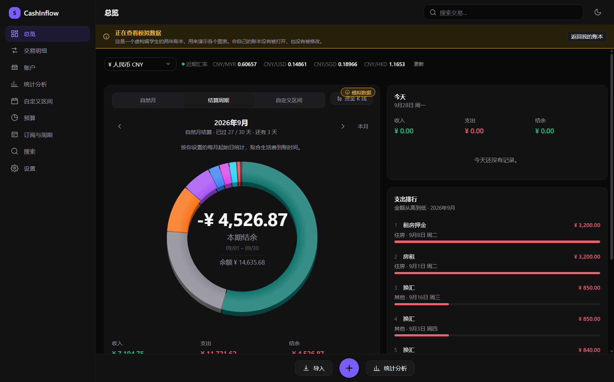

设置 → **模拟数据** → 「查看模拟数据」，就会打开一个**虚构留学生的两年账本**：
每月 5 号家里打 1 万元生活费（**放假月份没有**，只有父母不定期的小额转账）、
房租固定 3200、ChatGPT Plus / Netflix / B站大会员 / 网易云 / 加速器等订阅、
吃饭交通教育支出、换汇、借钱还钱、生日和春节礼金，以及几个月里超过 2000 元的大额支出。

**它是一个独立的数据库文件**（`demo/spendwise.db`），和你自己的账本互不影响：

- 打开模拟数据时会**关闭你自己的账本**，返回时再打开 —— 全程只有一个数据库连接，
  所以模拟数据不可能写进你的记录，你在模拟账本里的任何操作也不会碰到你的数据；
- **每次启动都从你自己的账本开始**，模拟模式不会被记住 ——
  一个会自己打开别人账本的记账软件不值得信任；
- 模拟数据是**现场生成**的（不是固定的几百行 fixture），可以随时「重新生成」；
- 打开模拟数据时，**应用顶部有横幅、每张图表右上角有「模拟数据」标记**，
  两个都不能关掉 —— 一个不像自己的数字，必须一眼看得出来不是自己的。

---

### 1️⃣ 首页圆环可以变成资金 K 线图，而且能告诉你**钱为什么这样动**

圆环右上角有一个切换按钮。点一下，这块卡片会**横向展开占满整个首页宽度**，
「今天」和「支出排行」自然下移到它下面，然后原来的圆环位置变成一张资金终端：

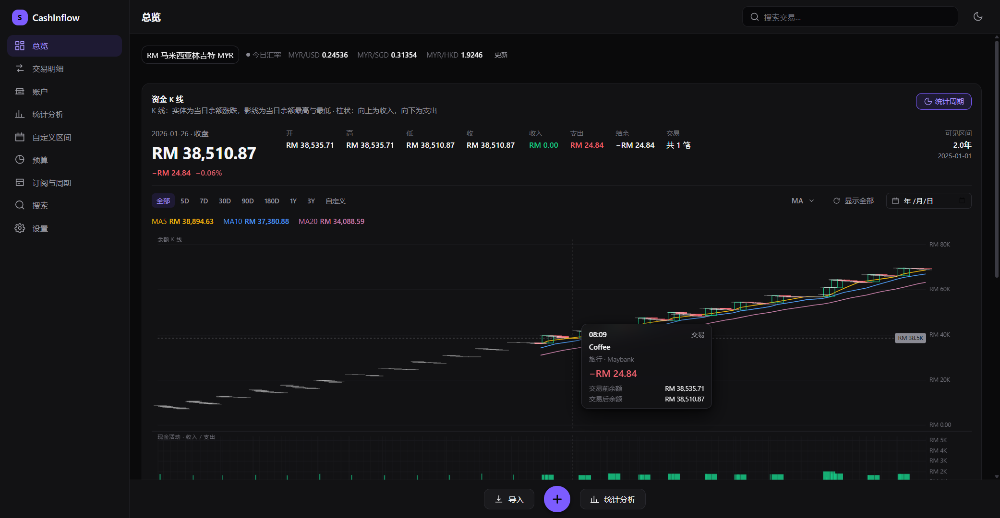

#### v1.6.0：两个区域，各管一件事

```
┌─────────────────────────────────────────────┐
│   余额 K 线        OHLC · 影线 · MA5/10/20   │  ≈52%
├─────────────────────────────────────────────┤
│   每日资金活动     一天一根，堆叠当天每一笔   │  ≈48%
└─────────────────────────────────────────────┘
```

上方回答「余额往哪走」，下方回答「今天的钱是怎么花的」。它们是**两个坐标系**：
X 轴（日期）完全共享 —— 同一列上下必定是同一天；Y 轴各自独立 ——
余额是存量、收支是流量，本来就不是一个量。

**每天只有一根柱子**，柱子按真实金额比例堆叠当天每一笔：

```
2026-09-28   当天支出 ¥1,860.94
  08:10  Transport  15%
  09:30  Coffee     10%
  12:45  Shopping   20%
  15:20  Groceries  15%
  19:40  Dinner     40%
```

比例严格等于「该笔 ÷ 当天合计」。时间只决定柱子内部的顺序（时刻升序；没有时间的排在最后、
保持录入顺序），**X 轴永远只到天**，不会把交易摆到某一分钟上。

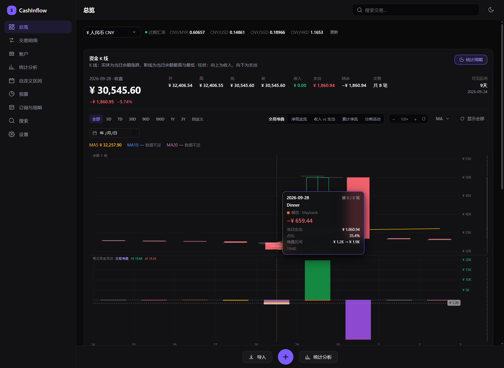

#### 上下分别定标：RM200 不会被 RM12,000 压成一条线

同一天里 RM12,000 的工资和 RM200 的晚饭放在同一根 Y 轴上，晚饭只占 1.6%（约五个像素），
等于「今天有没有花钱」根本看不出来。所以下方区域**上半区按收入最大值定标，下半区按支出
最大值定标**，两个窗口的数值都印在图上 —— 不是藏起来，而是写清楚。

**纵向缩放**：在下方区域滚轮 = 放大副图纵轴（不动时间轴、不动上方 K 线）；
按住 Ctrl 滚轮 = 缩放时间轴（v1.5 的老手感保留）。也有 `− 1.0× + ⟳` 控件。
柱子被截断时面板会显示「已截断」。

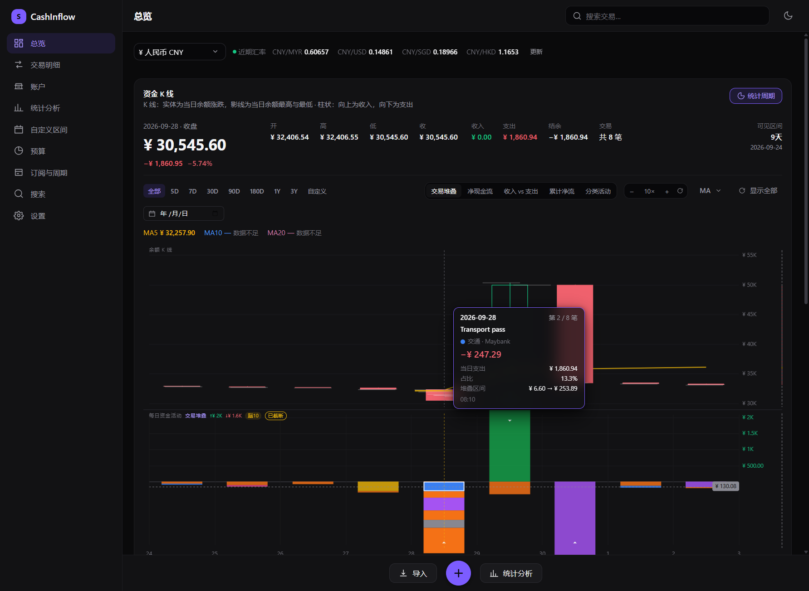

#### 十字准心：一条状态，两个面板

以前横线跟着鼠标、竖线吸附到交易、提示框读的又是另一根 K 线 —— 三个答案三个日期。
现在只有一个状态：**竖线锁定的那一天**同时决定上方的蜡烛、下方的柱子和日期标签，
**横线画在被选中的那个数据点上**。

- 命中判定在**数据空间**里做：指针高度换算成金额，再在当天累计区间里二分查找。
  所以 RM1 这种不到一个像素高的分段依然能被准确选中，面板放大缩小都不影响。
- 指到柱子之外的空白，**什么都不选**，而不是报当天最大的一笔。
- 提示框给出：日期、第几笔/共几笔、商家、分类、金额、占当日比例、堆叠区间、时间。

#### 五种副图，共用同一套准心

| 副图 | 回答的问题 |
|---|---|
| 交易堆叠（默认） | 今天的钱具体花在哪 |
| 净现金流 | 今天资金净增还是净减 |
| 收入 vs 支出 | 每天两边各是多少 |
| 累计净流 | 这段时间累计净流去了哪 |
| 分类活动 | 按分类汇总，颜色与圆环图一致 |

#### 圆环图：可悬停、可点击

悬停显示「分类 · 金额 · 占比 · 笔数」；点击**直接打开现成的交易明细页**并按该分类 +
当前周期筛选，页面顶部写明「来自总览的筛选」，可以一键清除。没有为圆环另造一套分类详情 ——
明细页本来就有筛选、编辑和导出。

#### 分类配色：全局一套，色相拉开

旧配色里 Food 和 Bills 都是橙色、Shopping 和 Subscription 都是紫色、Education 和
Investment 都是蓝色 —— 那是需要考试才能分辨的配色。新配色把 11 个支出分类铺在整个色相环上，
最接近的两对再用明度拉开。**用户手动选过的颜色一律保留**，只有「仍然是旧版默认色」的分类才
会被升级，不需要迁移数据库。圆环、副图、交易列表、统计、搜索、预算、详情都从同一张 token 表取色。

#### 每根蜡烛里面画着你当天的每一笔交易

这是它和股票 K 线最不一样的地方。股票蜡烛只能说「今天价格怎么走的」，因为价格没有明细；
**余额有** —— 每一笔交易都是推动它的一个事件。所以每笔交易都在蜡烛内部画一条细横线，
位置就是它成交后的真实余额：

```
        ┌────────────┐   ← 当日最高余额
        │            │
        ├────────────┤   ← 工资 +3000
        │            │
        ├────────────┤   ← 午饭 −30
        │            │
        ├────────────┤   ← 购物 −500
        └────────────┘   ← 晚饭 −80 · 当日收盘
             ▲
        当日期初余额
```

**两条相邻横线的高度差，就是那笔交易的金额。** 所以一笔 ¥3,000 的工资和一笔 ¥30 的午饭
在一根蜡烛里能直接分辨出来，不用把鼠标移上去。横线画在真实余额位置而不是把实体等分，
所以线和线之间的距离是有金额含义的。

鼠标移到某条横线上会高亮它，并弹出一张跟随光标的浮动卡片，显示那一笔的：时间（**没记录时间就写
「时间未记录」，不伪造 00:00**）、商家、分类、账户、备注、金额（保留两位小数），以及**成交前 /
成交后的余额**。点它直接打开**既有的交易详情抽屉**，返回后仍在同一根蜡烛上。

#### 两个面板，一根时间轴

余额 K 线和下方的活动图是**两个独立的绘图面板**，中间只有一条 1px 分隔线：

```
┌──────────────────────────────────────────────┐
│  余额 K 线        开 / 高 / 低 / 收 + MA      │  ≈72%
├──────────────────────────────────────────────┤  1px
│  现金活动         收入 / 支出 / 交易           │  ≈28%
└──────────────────────────────────────────────┘
   时间轴：只有一条，共享
```

- **X 轴完全共享**：一个毫秒级的可见区间、一套刻度、一个十字光标。两个面板各自维护时间范围
  是这块最不能犯的错 —— 上面停在九月、下面还在八月，等于在骗人。
- **Y 轴各自独立**：余额是存量，活动是流量，不是同一种量。共用一条轴的话，RM 3,000 的工资
  会把余额压成一条直线。活动图的轴永远从 0 起 —— 流量图不归零就是在歪曲每一根柱子。
- **绘图也独立**：一个面板一块 canvas，重画柱子不可能弄花蜡烛。

#### 连续缩放，以光标为中心

**滚轮 = 连续缩放，没有档位。** 缩放的本质是改变可见时间范围，蜡烛宽度、间隙、X 轴刻度、
Y 轴刻度、标记密度、十字光标全部由它重新算出来。

**光标指着的那个时刻会一直待在光标下面。** 指向 9 月 25 日滚轮放大，放大完 9 月 25 日还在
指针附近，而不是每次都以图表中心缩放。整个过程可以一路从「几年的资金走势」→「某个月」→
「这一周」→「9 月 25 日」→「12:14 那笔 RM 0.50」不用换图、不用换页面。

| 层级 | 例子 | 看到什么 |
|---|---|---|
| 宏观 | 2 年 | 2025 / 2026 |
| 中观 | 3 个月 | 09/07 · 09/14 · 09/21 · 09/28 |
| 微观 | 1 天 | 09:00 · 10:00 · … · 20:00 |
| 交易 | 1 小时 | 12:00 · 12:04 · … · 12:56 |

**数据库里没有时间就到此为止。** 只有日期、没有时刻的记录，最细只能看到「日」，界面会直接
说明「这些记录没有交易时间，最细只能看到日」—— 绝不把没时间的记录编造到 09:30 或 12:00 上。

#### Candle 间隙

实体占槽位的 **82%**，间隙 18% —— 是发丝缝，不是走廊。宽度随缩放动态变化（1px ~ 64px），
所以缩小时蜡烛变窄、放大时变宽，而间隙始终很小。

#### 小额交易：真实位置 + 大命中区

**视觉按真实金额画，交互按最小尺寸给。** 一笔 RM 0.50 相对于 RM 5,000 的余额不到一个像素，
所以：

- 画出来可能只有 1px，**真实金额绝不被放大**（不会把 RM 0.50 画成 RM 50）；
- **命中半径 20px**，按「距离鼠标最近的交易」判定；
- Y 轴按**可见区间**自动缩放，而不是永远从 0 开始 —— 这就是 RM 4.80 能获得真实像素分辨率的原因。

光标指向 12:14 那条线，无论它是 1px 还是 10px，都能 hover、都能点击、都能看到 `−RM 0.50`。

#### 顶部行情区

上排是**余额**（最大）、**净变化**与**百分比**；下面是高 / 低 / 开 / 收；再下面一行是
收入 / 支出 / 净额 / **交易笔数**。右侧是**可见区间**读数（例如「3个月 · 2026-07-01」）。

**它跟着十字光标走。** 把光标移到历史某天，这一整块就换成那天的数字 —— 并且明确写清
是哪一天：只有最新一根才写「当前余额」，历史日期写「9月13日 · 收盘」。
把历史余额误读成现在的钱，是这个界面最容易犯也最贵的错。

#### 点击蜡烛看当天明细

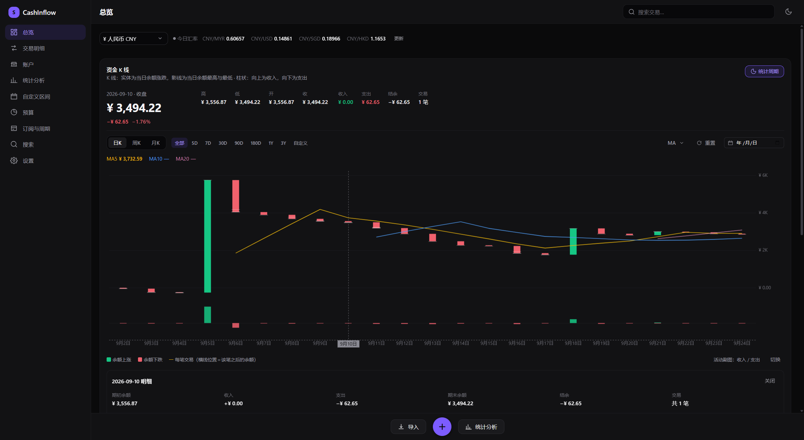

期初余额、收入、支出、期末余额、净额、笔数，下面是**当天每一笔交易的列表**。
点列表里任意一条，打开的同样是既有的交易详情抽屉。

#### 区间、跳转与 MA

| | |
|---|---|
| **区间** | 全部 / 5D / 7D / 30D / 90D / 180D / 1Y / 3Y / **自定义**（两个日期输入） |
| **缩放** | 滚轮，**以光标为中心**，连续无级 |
| **平移** | 按住拖动 |
| **跳转** | 日期选择器；那天没有记录时会说明，并落到最近有数据的一天 |
| **重置** | 回到全部历史 |

**没有「日K / 周K / 月K」按钮** —— 蜡烛粒度由可见范围推出来，不是从菜单里选的。

**MA5 / MA10 / MA20** 默认开启，**MA60 / MA250** 默认关闭 —— 它们在一年以内的账本上
只会把走势压平。点「MA」下拉可逐条开关。**数据不够的窗口会显示为禁用并标注「数据不足」，
不会用 12 个点硬算一条看起来很像的假线。** 图表上方实时显示当前光标位置各条均线的数值。

**滚动页面时鼠标在图表外，页面照常滚动。** 只有在两个面板内滚轮才会被图表接管（并且调用
`preventDefault`）—— 不是全局拦截。

---

### 2️⃣ 晚上一次性录入：批量记一笔 + 账单拍照识别

#### 一次记多笔

「记一笔」对话框里多了一个 **「+ 再记一笔」**。填好一笔点它，这一笔进「待保存」列表，输入框清空，
光标回到金额框 —— 接着记下一笔，不用关窗口、不用重开。

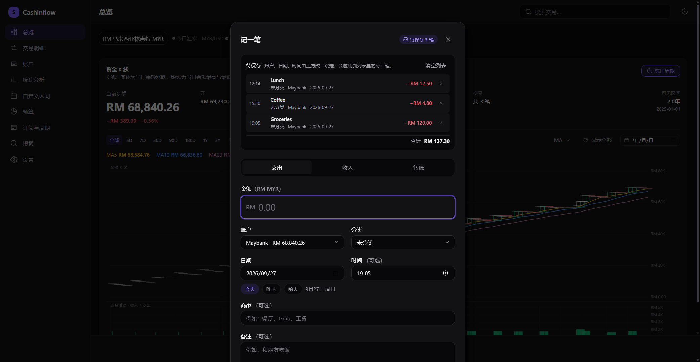

```
待保存 3 笔                                    清空列表
  12:14  Lunch      未分类 · Maybank · 09-27    −RM 12.50
  15:30  Coffee     未分类 · Maybank · 09-27    −RM 4.80
  19:05  Groceries  未分类 · Maybank · 09-27    −RM 120.00
                                        合计    RM 137.30
```

- **账户、日期、类型、时间由上方统一设定**，会自动应用到列表里每一笔 —— 晚上补录时这几个字段
  通常整批都一样，做成逐行填写只会把 4 次点击变成 4×9 次。
- **金额、商家、备注、分类是逐行的**，因为它们才是真正会变的东西。
- 每一行都可以单独删掉，也可以整批清空。
- 点「全部保存（N 笔）」一次性写入；**中途出错会明确告诉你第几笔失败、哪些已经存进去了**，
  而不是含糊地说「保存失败」。

#### 待保存的每一笔都能点开直接改

**列表里的每一行本身就是按钮**，点一下就在原位展开这一笔的编辑区 —— 金额、商家、分类、账户、
日期、时间、备注，全部是**这一行自己的值**，不会去读上方表单。改完点「完成」（或直接按回车）
写回列表，点「取消」（或按 Esc）原样不动。

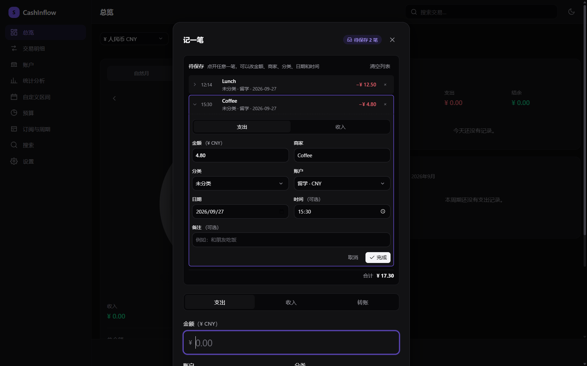

- 以前这里只有「删除」：金额填错一位，唯一的办法是删掉重填一整笔；**照片识别进来的行更是完全
  改不了** —— 而这些恰恰是最需要核对的行，因为是机器读的。
- 列表里用**回形针图标标出哪几笔来自照片**，一眼能看出哪些需要重点核对。
- 展开的行有自己的**支出 / 收入**切换；切成收入时，属于支出的分类会被自动清掉，
  而不是留一个保存时必然被拒绝的分类。
- 编辑用的是**工作副本**：没点「完成」之前，列表里那一笔始终是原值。
- 整行是一个真正的 `<button>`（可 Tab 聚焦、回车可开、读屏软件会念出来），
  不是靠 `onClick` 伪装成按钮的 `<div>`。

#### 账单币种和账户币种不一致时，说清楚而不是悄悄换掉

照片上的 `RM 172.50` 和一个 CNY 账户之间**没有汇率可用**，所以这一行会带着标记进列表：

```
12:14  MAYBANK  未分类 · 留学 · 2026-09-25   −RM 172.50  按 CNY 记账
```

点开后编辑区会明确告诉你：这一笔来自 MYR 账单（RM 172.50），所选账户是 CNY 账户，
**保存时会按 CNY 原样记账，不会自动换算** —— 请改选 MYR 账户，或把金额改成实际扣款的
CNY 金额。金额框的币种符号始终跟着**账户**走，因为那才是最终入库的币种。
（v1.5.2 只是把原样记账这件事做了，没有说出口；现在它写在你要点的那一行上。）

#### 从照片识别账单

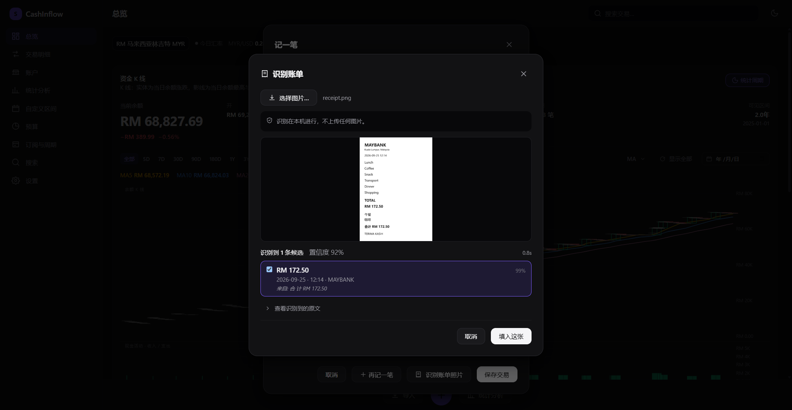

点「识别账单照片」，选一张截图或直接把它拖进窗口，本机识别出金额、日期、时间和商家，
按**置信度**列出候选，每个候选都告诉你**它是从哪一行读出来的**：

```
识别到 1 条候选        置信度 92%                0.7s
☑ RM 172.50                                     99%
  2026-09-25 · 12:14 · MAYBANK
  来自 合 计 RM 172.50
```

点「填入这张」，它就变成待保存列表里的一行，和其他手工录入的行完全一样 ——
**点开就能改**、可以删、可以继续加，最后一起保存：

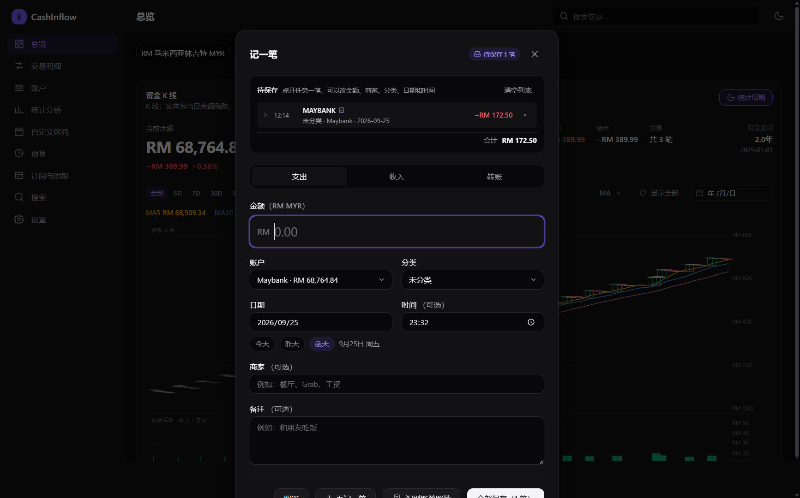

- **默认只勾选最可信的一条**，其余要你自己选 —— 一个「全部勾上」的默认值会把「请核对」
  变成「请确认」，然后用户就不会核对了。
- 识别到的原文可以展开查看，金额读错时你能看到它读的是哪一行。
- 币种和账户不同时会明确提示，**不会偷偷按某个汇率换算后当成原金额存进去**。

> **识别完全在本机完成，图片不会上传。** 引擎是随 App 打包的 tesseract.js（WASM），
> 中文 + 英文语言包也在安装包里。整个 App 唯一的联网行为仍然只有汇率查询 ——
> 一张银行账单的照片，不该因为「顺手调个云 API」就离开你的电脑。

**为什么不用云端 OCR API：** 免 key 的公共接口要么有速率限制、要么随时关停，而收费的要
按次计费、并且意味着把账单照片传给第三方。对一个「本地优先」的记账软件来说，
**离线是功能本身，不是妥协**。代价是安装包大了约 55 MB。

#### 修改已有交易

交易列表每一行**常驻一个编辑按钮**（以前只在鼠标悬停时才出现，结果是没人发现这个功能存在），
点开就是同一个表单，字段已经填好。总览页「今天」列表里的每一行也加了同样的编辑入口。
交易详情弹窗里的「编辑」保持不变。

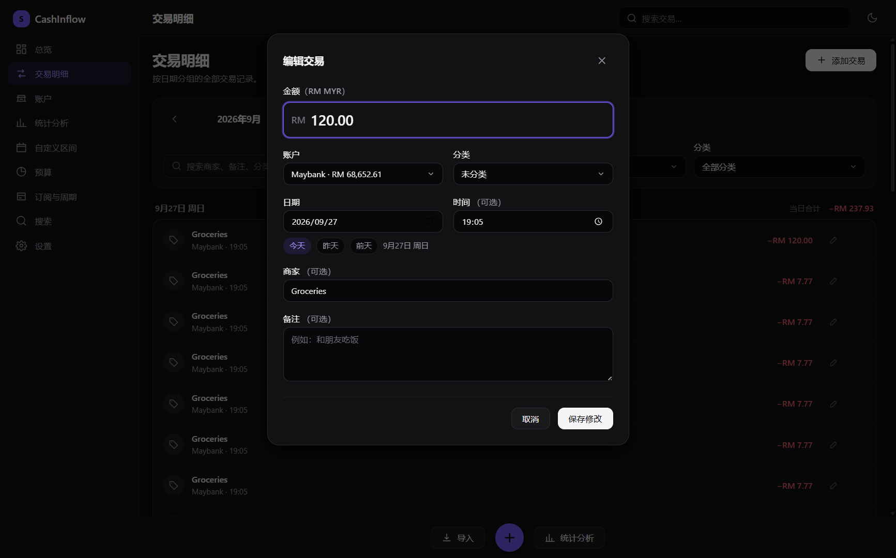

#### 生活费周期：为什么最多只能设到 28 日

如果你每月 5 号收到家里打的生活费，那么「本月」对你来说其实是 **8月5日 – 9月4日**。

用自然月统计会怎样？9 月 3 日打开 App，它告诉你「本月支出 ¥0」——你确实还没开始花这个月的钱。
但真实情况是你正处在上一周期的末尾，钱快花完了。

```
设置起始日 = 5

  ├──────────────┤├──────────────┤├──────────────┤
  8月5日       9月4日          10月4日
   └── 周期 A ──┘└── 周期 B ──┘
```

> **为什么最多只能设到 28 日？** 设成 31 日的话，2 月没有 31 号，周期长度会在
> 28–31 天之间变化，同一笔交易可能落进不同周期。上限 28 保证每个周期长度
> 都是一个月。设置界面里也写明了这一点。

#### 自定义区间：输入总金额，看会不会超支

任意起止日期，外加一个「这段日子一共带了多少钱」：

```
区间支出 / 总金额           ¥ 4,731.29 / ¥ 5,000.00
━━━━━━━━━━━━━━━━━━━━━━━━━━━━━━━━━━━━━━━━━━━━━━━━━━━━

剩余 ¥268.71     日均支出 ¥175.23     已过 27 / 30 天
                                       按此速度预计 ¥5,256.90
                                       按当前速度会超出总金额
```

重点是最后那行——**按当前速度会不会超支**，这才是「还能撑多久」的答案。
首页显示这个区间的收支，点「区间详情与预算推算」进入完整页面：


---

### 3️⃣ 首页可以切换统计周期：自然月 / 结算周期 / 自定义区间

**这是整个软件最核心的设计。**

大多数记账软件的首页只会告诉你「本月」——而「本月」到底是哪一个月，是软件替你决定的。

CashInflow 把它交给你：


| 模式 | 统计哪一段 | 什么时候用 |
|---|---|---|
| **自然月** | 1 日 → 月末 | 对账、报销、和家里核对账单 |
| **结算周期** | 你设定的起始日 → 下个月的前一天 | 生活费 5 号到账？那就是 8月5日 – 9月4日 |
| **自定义区间** | 你选的任意起止日期 | 一个学期、一趟旅行、两次兼职之间 |

**三种模式共用同一块首页**——同一个圆环、同一组收入/支出/结余、同一个支出排行。
切换周期只是换一个问题，不是换一个页面。

圆环中间的**本期结余**是这一段区间的收入减支出；下面单独一行是账户**余额**，
也就是你现在实际有多少钱。两者不是一回事：一笔期初余额不是收入，所以一段没有
任何交易的区间，本期结余确实是 0，但余额照样在那里。这种情况圆环中间会写
「本周期无收支」而不是显示一个看起来像加载失败的 ¥0.00。

首页是两列：**左边是你的账**（圆环、收支、结余、总余额），**右边是最近发生了什么**
（上面「今天」，下面「支出排行」）。两块都是交易列表，同一列从上往下读比并排三栏
更好扫，圆环也因此拿到了更宽的卡片。

首页点一下就能切：

| 自然月 | 结算周期 | 自定义区间 |
|---|---|---|
|  |  |  |

> **为什么不是简单地把自然月改成「起始日 = 1」？**
>
> 因为那样的话，想看一眼日历月就得先改设置、再改回来。
> 现在的做法是：**「自然月」只是这一次请求的起始日**，你保存的结算起始日不会被改写。
> 切换模式会记住，下次打开还是你上次看的那一段。

---

### 4️⃣ 真正的多币种，切换一下所有数字立刻变

人民币、马币、新币、美元、港币……同时持有多个币种账户。顶部切换显示货币，
**首页、交易明细、统计、总账**会一起换算。

```
¥ 人民币 CNY ▾    ● 今日汇率  CNY/MYR 0.60657  CNY/USD 0.14871  CNY/SGD 0.18995
```

| 按人民币显示 | 按马币显示 |
|---|---|
|  |  |

**切换货币只改变显示方式，不会修改任何一笔已记录的金额。** 账本永远以钱实际
发生的币种记账，所以对账时你看到的永远是银行账单上的那个数字。

---

### 5️⃣ 导入微信 / 支付宝 / 银行账单

不用手工录入。导出账单文件，选进来：

```
选择文件 → 解析 → 预览 → 检测重复 → 你确认 → 写入
```

支持 **微信支付**、**支付宝**（GBK 编码 + 24 行前言）、**Maybank**、**CIMB**，
以及任意通用 CSV / XLSX。


### 6️⃣ 算错的代价是「你照着错的数字做了决定」

金融软件出错的代价不是「不好看」。所以下面这些不是泛泛的「最佳实践」，而是
具体防住了某类真实 bug 的做法——完整清单见 [优势：数据正确性](#优势数据正确性)：

```
金额      一律用整数存最小单位（分/仙），不用小数
跨币种    先按币种分组求和，再统一换算，全程只舍入一次
汇率缺失  按原币显示并标注，绝不当成 1:1
转账      写两行并共享一个 transfer_id，从结构上被排除出收支
余额      由账本推导，绝不落库
```

---

## 功能截图

### 资金 K 线：把首页当看盘软件用

上下两个独立面板（余额 K 线 ≈72%，现金活动 ≈28%），共享一根时间轴。余额涨绿跌红，
每笔交易在蜡烛内部按**成交后的真实余额**画一条横线；鼠标指向任意一条都能弹出浮动卡片。

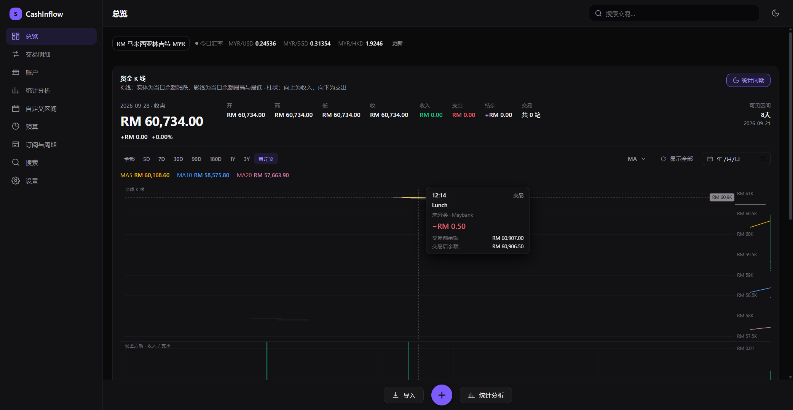

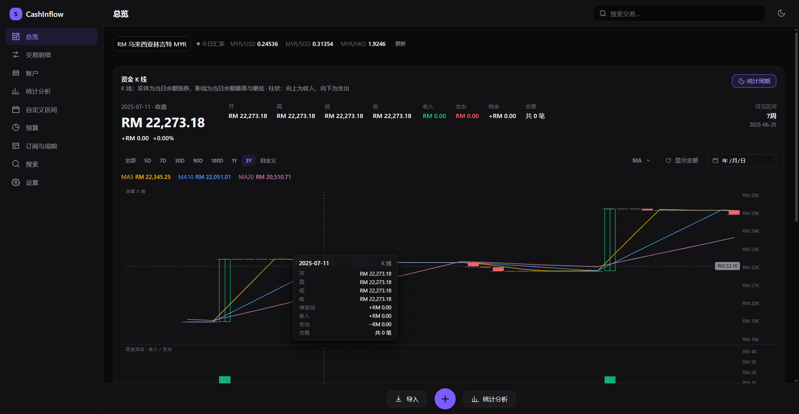

点开那一笔 `RM 0.50`：

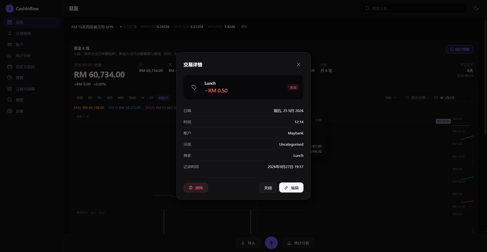

### 统计分析：趋势、构成、日历

日 / 周 / 月 / 年四种粒度，折线趋势 + 分类构成，下面是日历视图，点任意一天看当天明细。


### 账户：多币种余额分开看

不同货币的余额**不会相加**（¥5,000 和 RM5,000 不是一回事）。每个币种单独一行，
同时给出折算值：

```
账户余额（按币种）
CNY      ¥ 5,482.20     ≈ ¥ 5,482.20        1 个账户
MYR     -RM 1,585.80    ≈ -¥ 2,614.35       3 个账户
```


### 汇率与设置

三个免费汇率源自动回退，本地缓存，离线可用，支持手动填写你银行的真实汇率。


### 深色模式

深色是默认主题。浅色模式保持同样的信息层级，不是简单地把背景刷白。


新增的「点开待保存的一行改详情」两种主题都验过（下面是同一笔识别账单在两种主题下的编辑态）：

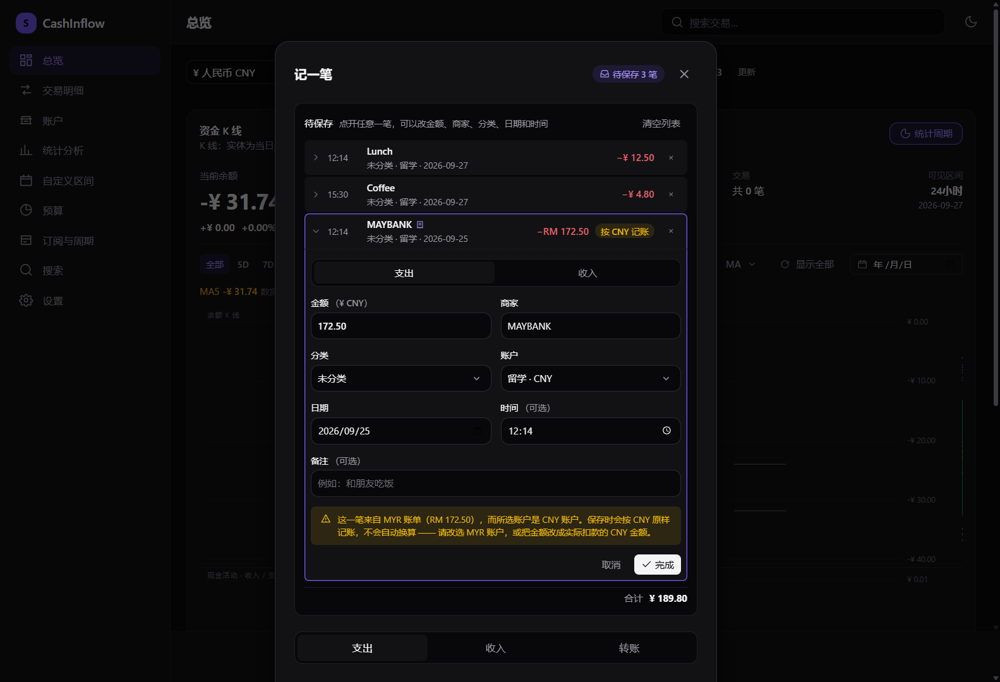

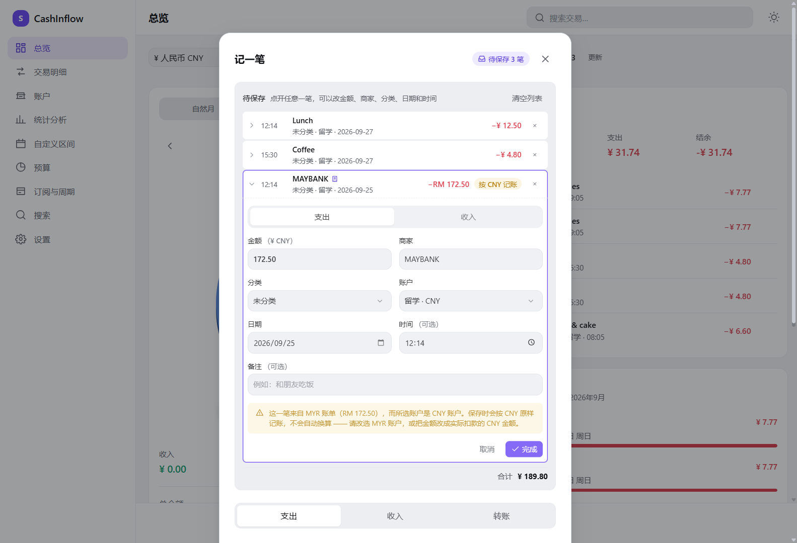

---

## 优势：数据正确性

金融软件出错的代价不是「不好看」，而是**你根据错误的数字做了决定**。
下面每条都不是泛泛的「最佳实践」，而是具体防住了某类真实的 bug。

### 金额一律用整数存，不用小数

```js
// 浮点数会这样：
0.1 + 0.2          // 0.30000000000000004
100.1 + 200.2      // 300.29999999999995

// CashInflow 存整数：
10010 + 20020      // 30030  精确等于 ¥300.30
```

数据库里 `¥18.50` 存成 `1850`（分），`RM 18.50` 存成 `1850`（仙）。
只在最后显示时才格式化成小数。

### 跨币种聚合绝不直接相加

最容易写错的代码长这样：

```sql
SELECT SUM(amount) FROM transactions WHERE date BETWEEN ? AND ?   -- ❌
```

只要你有两个币种的账户，这行代码就会把 `2800`（分）和 `1850`（仙）加起来得到 `4650`——
**一个看起来很合理、实际毫无意义的数字**。

正确做法是按币种分组、各自换算、最后合并，**全程只舍入一次**：

```sql
GROUP BY currency   -- 先分币种，组内求和是精确的
```

### 没有汇率时，绝不假装汇率是 1

某个币种查不到汇率时，金额会**按原币显示并标注 `*`**，同时明确告诉你汇率缺失。
凭空按 1:1 换算是最危险的失败方式——因为结果看起来完全正常。

### 转账永远不会被算成支出

转账写**两行**（`type = 'transfer'`），一出一进，用一张 `transfers` 表关联。
所有收入/支出统计都按 `type` 过滤，转账**从结构上**就被排除了——
不存在「某个查询忘了特殊处理」的可能。

```
Maybank → Cash RM500

Maybank   -500.00    转账腿
Cash      +500.00    转账腿
本期支出   不变
总余额     不变
```

### 余额永远由账本推导，不落库

```
余额 = 期初余额 + SUM(所有交易的有符号金额)
```

存一个「当前余额」字段等于维护第二份真相，某条写入路径忘了更新就会漂移。
个人账本规模下 `SUM` 是瞬间的，所以正确性优先。

### 其他不妥协的地方

- **有交易的账户不能删除** → 提示改为归档，历史记录不会被顺手清掉
- **在用的分类不能删除** → 让你选择把交易转移到哪个分类，绝不静默改成「其他」
- **周期无缝铺满日历**（有测试直接断言）：有缝隙会漏掉交易，有重叠会重复计算
- **重复导入不会翻倍**：微信/支付宝用交易单号做键；没有单号时用内容哈希 +
  出现序号，**同一天真的喝了两杯咖啡两笔都能导入，重新导入同一个文件则全部识别为重复**
- **账户币种一旦有交易就不能改**：存储的整数会被重新解释成另一种货币

---

## 隐私与安全

| | |
|---|---|
| 数据位置 | `%APPDATA%\CashInflow\spendwise.db` |
| 联网 | **仅**汇率查询。三个免费公开接口，无需 API Key |
| 遥测 / 分析 | 无 |
| 远程数据库 | 无 |
| 渲染进程网络权限 | **被 CSP 完全禁止**，汇率请求统一走主进程，可审计 |
| 数据库加密 | 无（请配合 BitLocker 等全盘加密） |

架构上渲染进程**碰不到数据库、碰不到文件系统**：

```
┌──────────────────────────────────────────────┐
│  渲染进程 (React，无 Node 权限)               │
└───────────────────┬──────────────────────────┘
                    │  window.api.<方法>()  仅白名单
┌───────────────────▼──────────────────────────┐
│  preload（唯一桥梁，不暴露 ipcRenderer 本身） │
└───────────────────┬──────────────────────────┘
                    │  只传数据，不传 SQL
┌───────────────────▼──────────────────────────┐
│  主进程：校验 → 业务规则 → 参数绑定查询       │
└───────────────────┬──────────────────────────┘
                    │
┌───────────────────▼──────────────────────────┐
│  SQLite（本地文件，WAL 模式）                 │
└──────────────────────────────────────────────┘
```

没有任何通道接受 SQL 字符串。商户名写成 `'; DROP TABLE transactions; --`
也只是一个名字奇怪的商户。

---

## 安装使用

前往 **[Releases](https://github.com/Lidazou/CashInflow/releases/latest)** 下载。

| 文件 | 说明 |
|---|---|
| `CashInflow-1.7.0-x64-setup.exe` | **安装版**。创建开始菜单与桌面快捷方式，并注册卸载项 |
| `CashInflow-1.7.0-x64-portable.exe` | **免安装单文件版**。直接双击运行，不写注册表、不建快捷方式 |
| `SHA256SUMS.txt` | 上面两个文件的 SHA-256 校验和 |

两个版本功能完全相同，读写同一个数据库。

**不需要管理员权限**，也**不需要预装 Node.js 或任何运行环境** —— 116 MB 里已经包含
整个 Electron 运行时。这就是它比普通记账软件大的原因。

> 安装包没有代码签名证书，所以 Windows SmartScreen 可能会提示「未知发布者」。
> 点「更多信息」→「仍要运行」即可。介意的话可以用免安装版，或者先核对
> `SHA256SUMS.txt` 里的校验和。

### 卸载

从「设置 → 应用」或开始菜单卸载。**卸载不会删除你的账本数据** —— 数据库留在
`%APPDATA%\CashInflow`，重新安装后账目原样还在。

### 第一次打开

```
启动 → 欢迎页 → 建立第一个账户（名称、类型、币种、期初余额） → 总览
```

想先看看效果，点欢迎页的 **「用示例数据体验」**。示例数据只能加到空账本里，
可以一键清除，不会影响你之后记录的真实数据。

---

## 开发

需要 Node.js 22.12 或更高版本。

```bash
npm install          # 安装依赖

npm run dev          # 开发模式（热重载）
npm test             # 运行测试
npm run typecheck    # 类型检查
npm run build        # 生产构建
npm run dist         # 打包 Windows 安装程序
```

> **关于 npm 缓存**：本项目的 `.npmrc` 把缓存指向工作区内目录。某些沙箱环境会
> 导出 `npm_config_cache` 环境变量，而 npm 的环境变量优先级高于项目 `.npmrc`，
> 此时需要显式传参：`npm install --cache "C:\path\to\.npm-cache"`

### 项目结构

```
src/
├── main/                    Electron 主进程
│   ├── database/
│   │   ├── connection.ts    打开、配置（WAL、外键）、迁移、备份
│   │   ├── migrations/      版本化 schema，每个迁移在事务里执行
│   │   ├── mappers.ts       SQLite 行 → 领域对象
│   │   └── errors.ts        带稳定错误码的类型化异常
│   ├── services/            全部业务规则
│   │   ├── accounts.ts      账户 CRUD + 派生余额
│   │   ├── transactions.ts  账本、转账、聚合
│   │   ├── statistics.ts    总览、趋势、日历、自定义区间
│   │   ├── exchange.ts      汇率抓取、缓存、手动覆盖
│   │   ├── currency-aggregate.ts  ★ 跨币种聚合（只舍入一次）
│   │   ├── import.ts        解析 → 校验 → 查重 → 提交
│   │   ├── csv.ts           RFC 4180 解析、日期金额归一化
│   │   ├── import-presets.ts 各平台列映射
│   │   └── settings.ts      设置、预算、订阅、周期规则
│   ├── ipc/index.ts         通道注册、错误信封
│   └── index.ts             启动、窗口、安全配置
├── preload/index.ts         contextBridge 白名单
├── renderer/                React 界面
│   └── src/
│       ├── components/      外壳、对话框、图标、图表
│       ├── pages/           每个路由一个文件
│       ├── store/           Zustand（设置、汇率、UI 状态）
│       └── styles/          设计令牌 + 全局样式
└── shared/                  两个进程共用
    ├── types/               领域类型 + IPC 契约
    ├── lib/money.ts         整数金额运算与格式化
    ├── lib/rates.ts         ★ 汇率换算（单次舍入）
    ├── lib/periods.ts       ★ 结算周期与自定义区间
    ├── lib/dates.ts         本地日历日期处理
    └── lib/i18n.ts          全部中文界面文案
```

### 重新生成 README 里的截图

截图不是手截的，`tools/` 下有一套可复现的脚本（该目录不参与打包）：

```bash
# 1. 用一次性配置目录启动，绝不碰你真实的账本
electron . --remote-debugging-port=9222 --user-data-dir=%TEMP%\sw-shot-profile

# 2. 一次连接跑完全部页面
node tools/shots.cjs                 # 全部
node tools/shots.cjs dashboard       # 只重拍某几张

# 3. 示意图（三种统计周期）
powershell -File tools/make-diagram.ps1
```

窗口宽度通过 `CASHINFLOW_WINDOW_WIDTH` / `CASHINFLOW_WINDOW_HEIGHT` 指定：
首页三栏布局需要 1440 CSS 像素以上才会出现，所以截图必须开一个够宽的窗口。

> `tools/make-diagram.ps1` 必须以 **UTF-8 BOM** 保存：Windows PowerShell 5.1 会把
> 没有 BOM 的脚本当 ANSI 读，脚本里的中文字符串会变成乱码甚至语法错误。
> `node tools/bom-ps1.cjs tools/make-diagram.ps1` 负责加 BOM。

---

## 测试

```bash
npm test
```

**504 个用例，跑真实 SQLite 文件，不用 mock。**

| 测试文件 | 覆盖内容 |
|---|---|
| `money.test.ts` | 整数运算、解析、格式化，以及所规避的浮点失败模式 |
| `rates.test.ts` | 换算舍入、交叉汇率、缺失汇率、新鲜度分级 |
| `periods.test.ts` | 周期运算、**日历无缝铺满**、任意区间校验 |
| `dashboard-period.test.ts` | **首页三种周期模式**：窗口解析、按周期取数、切换后设置不被改写 |
| `kline.test.ts` | **资金 K 线**：自适应粒度阈值、无缺口补桶、均线窗口、跨币种单次舍入、日/桶一致性 |
| `multi-currency.test.ts` | 服务层跨币种聚合、周期感知预算、离线汇率回退 |
| `ledger.test.ts` | schema 与迁移、余额、转账、校验、引用完整性、持久化 |
| `import-parser.test.ts` | RFC 4180、分隔符嗅探、表头定位、日期金额归一化 |
| `import-e2e.test.ts` | 真实文件全流程、查重、微信/支付宝预设、GBK 编码 |
| `daily-activity.test.ts` | **每日资金活动**：堆叠比例、累计区间、排序、独立/双向定标、**亚像素分段的数据空间命中** |
| `xlsx-export.test.ts` | **Excel 导出**：回读工作簿验证日期类型、金额为数字、冻结、筛选范围、只导出筛选结果 |
| `category-colors.test.ts` | 分类配色：色相分离、旧默认色升级、用户自选色保留、tint 与对比度 |
| `chart-window.test.ts` | 可见区间切片 —— 那个「只画了历史后一半」的 bug 的回归测试 |
| `receipt.test.ts` | 账单 OCR 文本解析：**用真实 tesseract 输出做夹具**，中文词内空格、金额出现两次 |
| `i18n.test.ts` | 文案模板占位符：**每一处都要被替换**（`{to}` 出现两次时只替换第一个是个真实 bug） |
| `acceptance.test.ts` | 规格书里的验收标准逐条实现为测试 |

两个值得一提的断言：

```js
// 规格书点名的浮点检查
100.10 + 200.20  →  30030 分，精确
                而不是 300.29999999999995

// 转账不变式
Maybank → Cash RM500 后，两个账户余额之和不变，本期支出不变
```

---

## 已知限制

**未实现**

- 不直连银行 / 微信 / 支付宝 API，只做文件导入
- 数据库文件**不加密**（请用 BitLocker 等全盘加密）
- 不支持一笔支出拆分到多个分类
- 不支持收据 / 附件图片
- **不支持跨币种转账**：需要给转账本身套汇率，两腿会不等值。宁可拒绝也不近似
- 导入的交易不自动分类（分类来自文件或归为「其他」）
- 不支持 `.xls`（旧版 Excel）和 PDF 导入，需另存为 `.xlsx` 或 CSV

**需要知道的**

- **汇率是中间价**，不是你银行卡或汇款公司的实际成交价，后者含点差
- **汇率最多每 6 小时更新一次**（三个数据源都是日更），这是参考汇率不是实时牌价
- **手动汇率会完全替换在线汇率**，且在你主动刷新前不会被自动覆盖
- 单实例运行；第二次启动会聚焦已有窗口，避免两个窗口显示不同数据
- 示例数据只能加到空账本，这保证了示例永远不会混进真实数据
- 分类改名不会改写历史（交易引用的是分类 id）
- **分类类型和有交易的账户币种都不能改**，因为会重新解释每一笔历史交易
- 重复检测**只在同一账户内比对**，同一笔消费导入到两个账户不会被识别
- **账单币种和账户币种不一致时，App 不会替你换算**：照片上的 `RM 172.50` 记进 CNY 账户，
  存的就是 172.50，只是币种变成 CNY。待保存列表和它的编辑区都会明确标出这件事 ——
  正确的做法是给这一笔选一个同币种的账户，或自己填实际扣款的金额
- **自定义区间的「今天」列和总余额不跟着变**：它们回答的是「现在有多少钱」，
  把它塞进周期选择器里只会让人算错。只有圆环、收支、结余、支出排行跟周期走
  （圆环中间的余额那一行也是「现在有多少钱」，它不随区间变化，这正是它有用的原因）
- **首页不会自动从已结束的周期跳回来**：切到 6 月就会停在 6 月（会标注「已结束」），
  点「本月」回到当前周期
- **自定义区间的起止日期只属于首页**：统计页、预算页仍然跟着你的结算周期走。
  想让整个 App 换周期，去设置里改「每月起始日」

**平台**

- 在 Windows 10 / 11 x64 上构建与验证。架构本身跨平台，但只配置了 Windows 打包

---

## 技术栈

| 层 | 选型 | 原因 |
|---|---|---|
| 外壳 | Electron 44 | 能产出真正的 Windows `.exe` 和安装程序 |
| 界面 | React 19 + TypeScript | 开发快，长期可维护 |
| 构建 | electron-vite 5 + Vite 7 | 一份配置产出 main / preload / renderer 三个包 |
| 数据库 | better-sqlite3 13 | 真正的嵌入式关系库，同步 API，零配置 |
| 图表 | 手写 SVG（小图）+ Canvas（K 线） | 见下 |
| 状态 | Zustand | 很小，且只有真正全局的状态才放进去 |
| 表格 | ExcelJS | MIT 协议，支持流式读取 XLSX |
| 测试 | Vitest | 快，且跑真实数据库而不是 mock |

**运行时依赖只有三个：`better-sqlite3`、`exceljs` 和 `tesseract.js`**
（OCR 引擎，随包携带中英文语言包）。

### 为什么 K 线图没有用图表库

参考了 [KLineChart](https://github.com/klinecharts/KLineChart)（零依赖、Canvas 渲染、
自带均线与十字光标）的架构，但**没有引入它**，两个原因：

1. **数据模型对不上。** 它的输入是 OHLC 行情；这里的「K 线」是**每日余额 + 当日收支**，
   柱子还要按笔画出交易分隔刻度，悬停要列出当天每一笔流水。硬套 OHLC 会在中间加一层
   翻译代码，而那一层正是最容易算错的地方。
2. **配色必须跟着主题走。** 涨跌色从 CSS 变量里读：深色绿涨红跌，浅色按国内习惯红涨绿跌。
   自绘 Canvas 直接读 `getComputedStyle` 就够了，套库反而要绕一圈。

真正拿过来的是它的**做法**：视口模型（可见区间 + 偏移）、十字光标与轴标签、在完整序列上算
均线再裁到视口、按跨度自适应粒度、换粒度时按日期重新定位。

统计页那几个小图仍然是手写 SVG —— 那里节点少，SVG 更好写也更好调试；到了几千根蜡烛还要
跟着光标实时平移，SVG 就会卡。

### 打包时最关键的一行

`electron-builder.yml` 里设了 **`npmRebuild: false`** 并解包原生模块：

```yaml
npmRebuild: false
asar: true
asarUnpack:
  - node_modules/better-sqlite3/**
```

better-sqlite3 v13 基于 N-API，自带 win32-x64 预编译二进制。而 electron-builder 的
`npmRebuild` 默认是 `true`，会让 `@electron/rebuild` 重新编译任何带 `binding.gyp`
的包——**丢掉自带的预编译版本**，换成针对不同 ABI 编译的版本，运行时就会以
模块版本不匹配失败。另外 `.node` 文件无法从 `app.asar` 内部加载，所以
`asarUnpack` 是必需项而非优化项。

---

## English overview

**A local-first, multi-currency personal finance manager for Windows**, built for
Chinese students studying abroad.

**Six things set it apart:**

1. **Batch entry, because receipts arrive in piles.** The add-transaction dialog has a
   "+ one more" button: fill in a row, file it into a pending list, and the form clears for
   the next one without the dialog ever closing. Account, date and type are set once for the
   batch — those are what an evening's receipts have in common — while amount, merchant and
   category stay per-row. One save writes them all, and a half-failed batch says exactly which
   row failed and what did get written rather than "save failed". **Every pending row is a
   button**: click it and that row opens its own editor in place — amount, merchant, category,
   account, date, time, note — applied by "done" or Enter, abandoned by "cancel" or Escape.
   Rows that came from a photo are marked as such, because those are the ones worth checking,
   and a receipt in a currency the chosen account is not in says so on the row instead of being
   quietly booked at face value.

2. **Receipt photos, read on your own machine.** Drop a screenshot or a photo onto the dialog
   and it comes back as a candidate amount, date, time and shop — with the line each figure was
   read from, and only the most confident candidate pre-selected, because a "select all"
   default turns "please check" into "please confirm" and then nobody checks. Recognition is a
   bundled tesseract.js WASM engine with Chinese and English language packs: **no image leaves
   the computer**, and the app's only network call is still the exchange-rate lookup. That is
   what justifies ~55 MB of installer instead of calling a free cloud OCR endpoint — for a
   local-first finance app, offline is the feature, not the compromise.

3. **A switchable reporting period, on one dashboard.** Three modes share the same
   ring, the same income/expense/net figures and the same biggest-expense list:
   a plain calendar month, your own settlement cycle (allowance in on the 5th means
   5 Aug – 4 Sep), or an arbitrary date range for a semester or a trip. Switching
   changes the question, not the screen — and the choice is remembered. A calendar
   month starting on the 3rd reports that you have spent ¥0, which is both true and
   useless.

4. **Real multi-currency.** Hold CNY, MYR, SGD, USD, HKD and more. Switch the
   display currency and every figure re-converts. Live rates come from three free
   key-less providers tried in order, cached in SQLite, and fully usable offline.
   Switching currency never modifies a stored amount.

5. **Statement import.** WeChat Pay, Alipay (GBK-encoded, 24-line preamble),
   Maybank, CIMB, and any generic CSV/XLSX, with duplicate detection that lets two
   genuine same-day purchases through while catching a re-import of the same file.

6. **A semester budget, not just a month.** Point the dashboard at arbitrary dates,
   enter what you brought with you, and see spend against it plus a pace projection
   that answers the only question that matters: at this rate, will it last?

**The K-line is a balance chart, not a stock chart with your money in it.** A price
candle can only say that something moved; a balance candle can say *why*, because
every transaction is a labelled event that pushed it. So each entry is drawn as a
hairline at the exact balance it produced, and the gap between two hairlines is that
transaction's size — a ¥3,000 salary and a ¥30 lunch are distinguishable inside one
candle without hovering.

The balance K-line and the cash-activity bars are **two independent panels sharing one
time axis**: their own heights, their own value axes (the balance axis is fitted to the
visible window and deliberately does *not* start at zero; the activity axis always
does), and their own draw passes. Zoom is **continuous and cursor-anchored** — there is
no 日K/周K/月K menu, and the candle size is derived from the visible time range — so a
reader scrolls from two years of history into a single day, and from there into
`12:14 Lunch −RM 0.50`, without switching views. Intraday candles are reconstructed
from the instants the entries actually happened at; a ledger with no times in it stops
at the day and says so rather than inventing 09:30.

Small amounts get a 20-pixel hit radius against a marker that may be one pixel tall:
the visual stays truthful to the money, and aiming is forgiving.

**Correctness is the design goal, not a feature.** Amounts are integers in each
currency's minor unit, balances are derived rather than stored, transfers are
written twice and structurally excluded from spending, and cross-currency totals
are grouped by currency and rounded exactly once. An unavailable rate is reported
rather than silently treated as 1:1.

**Privacy:** all data lives in `%APPDATA%\CashInflow`. The only network call is the
exchange-rate lookup; the renderer is forbidden from making any outbound
connection by its Content-Security-Policy.

**370 tests** run against a real SQLite file, including the specification's
acceptance criteria as executable tests.

---

## License

MIT
